# azure-devops-try

### SQL Database

- SQLデータベース(無料プラン) というボタンから作成
- 先にデータベースサーバーを作成する必要あり
  - 認証方法は「SQL 認証」へ。
  - 要はユーザー名/パスワードでの認証ということ。
- できたらこんな感じ
  - 
- ファイアウォールの設定は注意
  - あんま詳しく見れてない
  - デフォルトの設定が緩めに見えているので実運用ではちゃんと確認した方がいい
- 接続文字列というページにいわゆる DBURI 的なものが書かれている
  - これをApp Serviceの環境変数の接続文字列（AzureSQL）へセットする
  - 
- クエリエディタよりSQLを実行できる
  - 
  - 

テーブル作成
```sql
CREATE TABLE notes (
    id INT IDENTITY(1,1) PRIMARY KEY,
    title NVARCHAR(200) NOT NULL,
    content NVARCHAR(MAX) NULL,
    created_at DATETIME2 DEFAULT SYSUTCDATETIME()
);

INSERT INTO notes (title, content) VALUES
(N'テスト', 'this is test'),
('test', 'test'),
('aaa', 'aaa'),
('bbb', 'test');

DELETE FROM notes;
```

### Blob Storage

- ストレージアカウントを作成
- 作ったらこんな感じ
  - 
- 静的ウェブホスティングの設定
  - 
- で $web というところにアップロードする
  - 
  - 
- するとみれる

### App Service
- Windows .NET 10 にて作成
  - 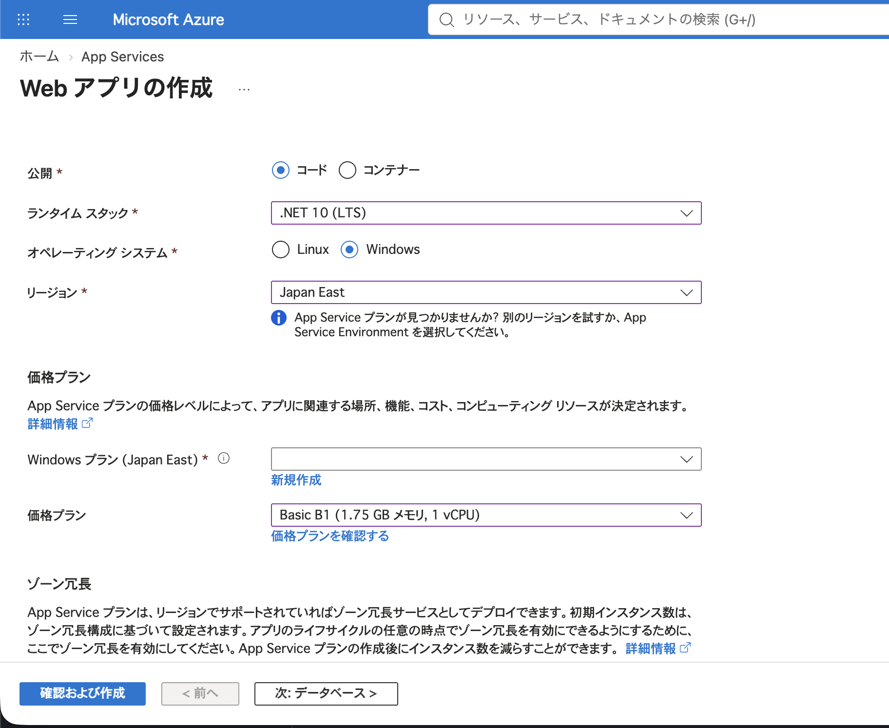
- 作ったらこんな感じ
  - 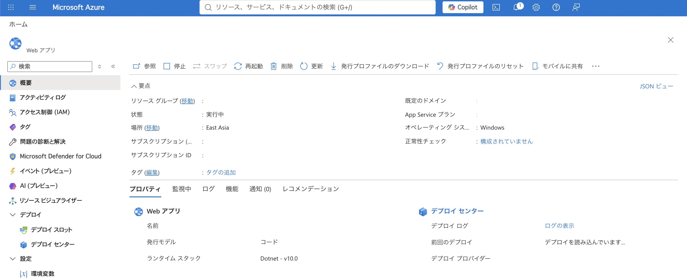
- Front Door からのみアクセスできるよう設定する。ちなみにここでIPアドレスをホワイトリストに入れることも可能
  - 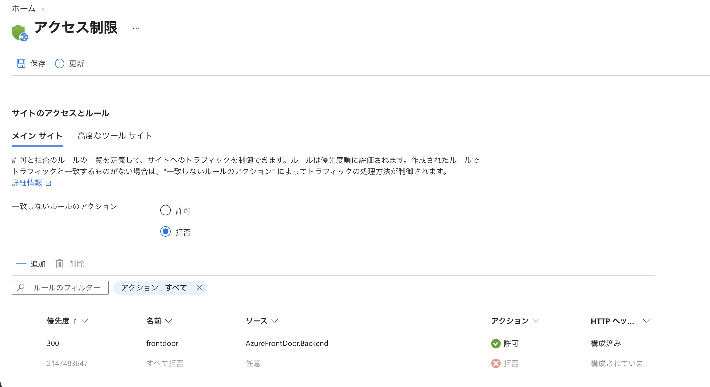
- よくわからんがデバッグコンソール的なものもついてくる
  - 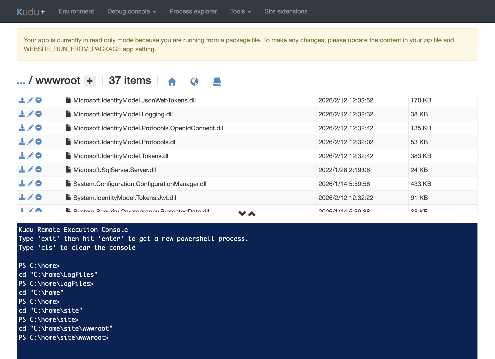

### Front Door
- フロントドアプロファイルを作成
- 作ったらこんな感じ
  - 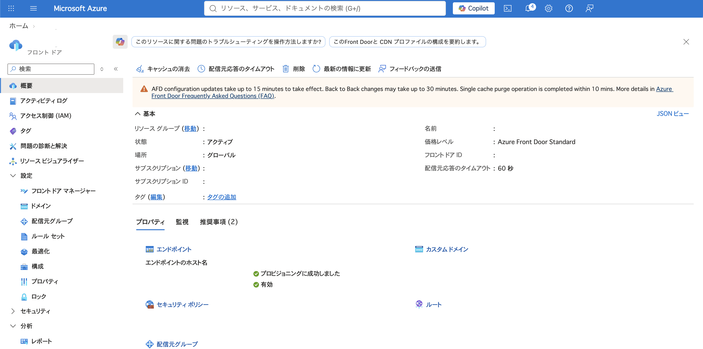
- Blob Storage の静的ウェブホスティングをオリジンに指定（デフォルト）
  - 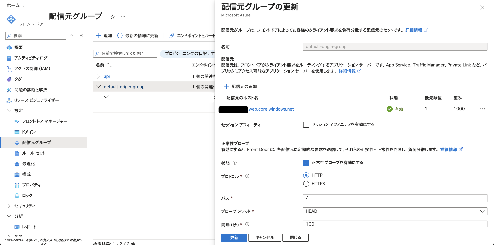
- App Service のオリジンを作成
  - 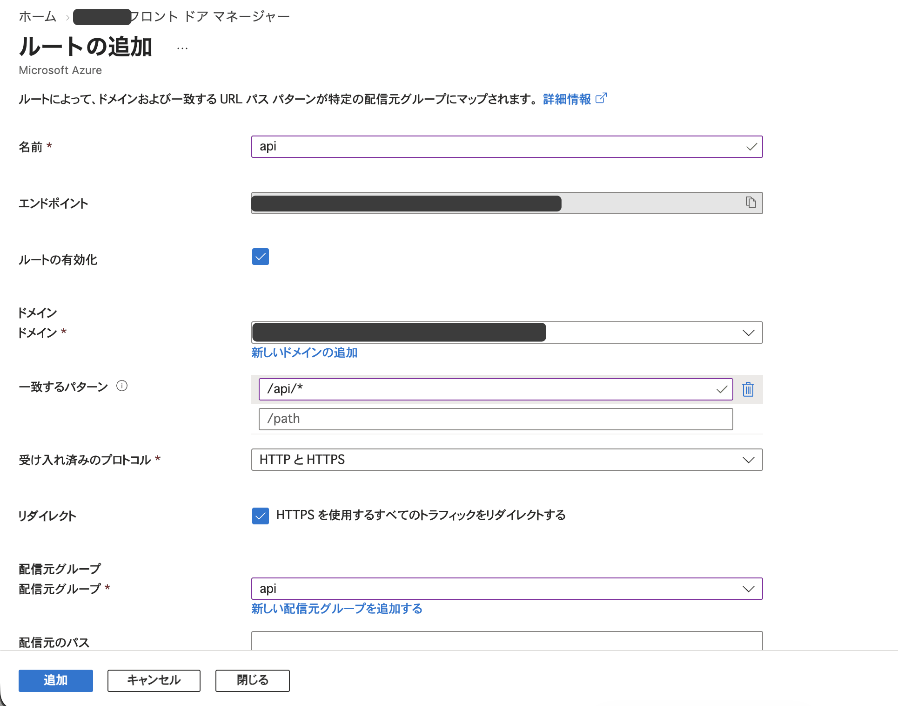
  - 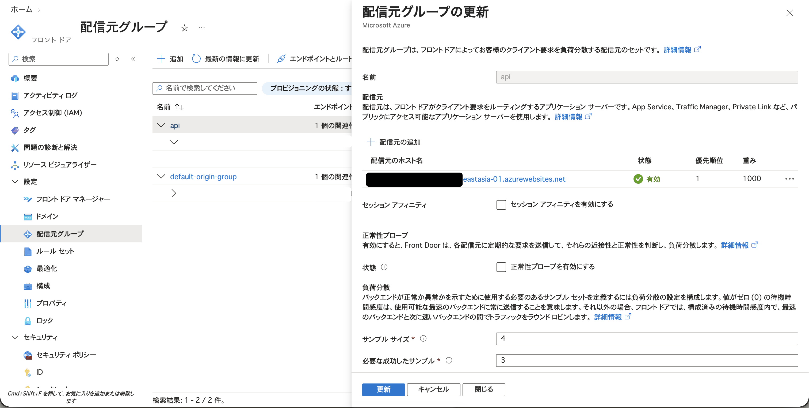
- そしてフロントドアマネージャーにてルート設定 (/api/*)
  - 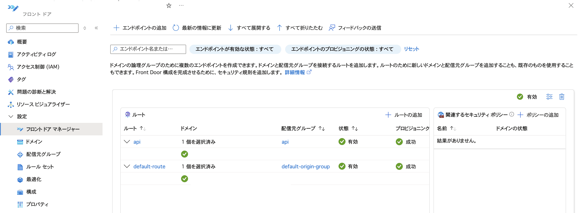

### Azure DevOps
- プロジェクトを作成
- GitHub Repository と繋ぐ
- 作ったらこんな感じ
  - 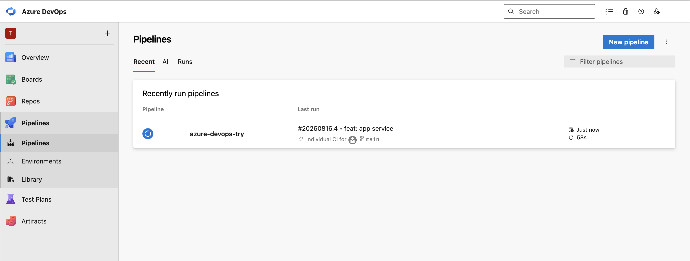
- ビルドスクリプトはこんな感じ。yamlで
  - 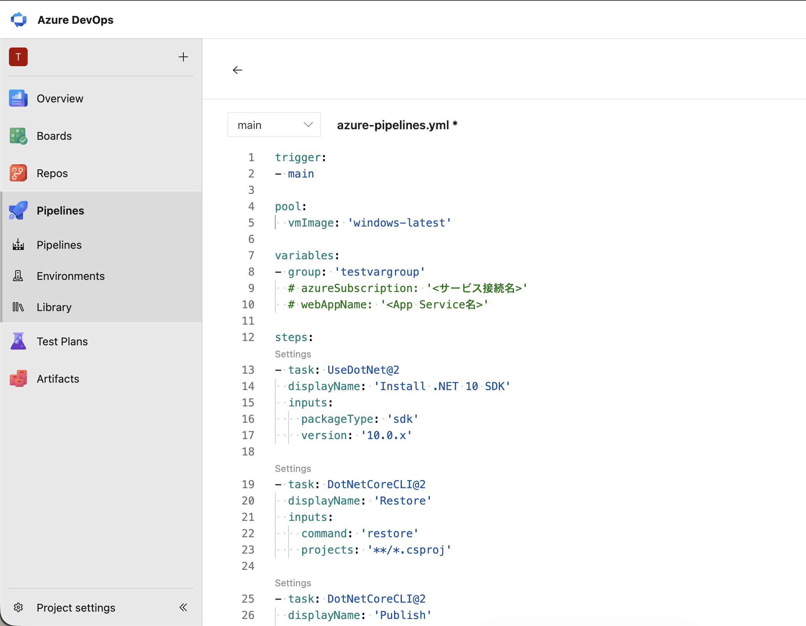
- デプロイに成功するとこんなログ
  - 
- 環境変数は Library の Variable Group で管理するのが良さそう
- Azure へは Resource Manager の workload identity federation にて接続するっぽい

### EntraID
- SPA ように client を作成（アプリケーションの登録）
- App Service でも client を作成。EasyAuth と呼ぶらしい
  - 「許可されたクライアント アプリケーション」に SPA の client id を入れる
  - 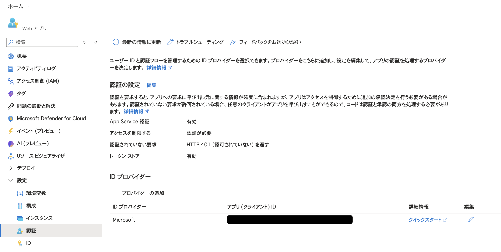
  - で、EntraIDでAPIの公開設定へ。
  - 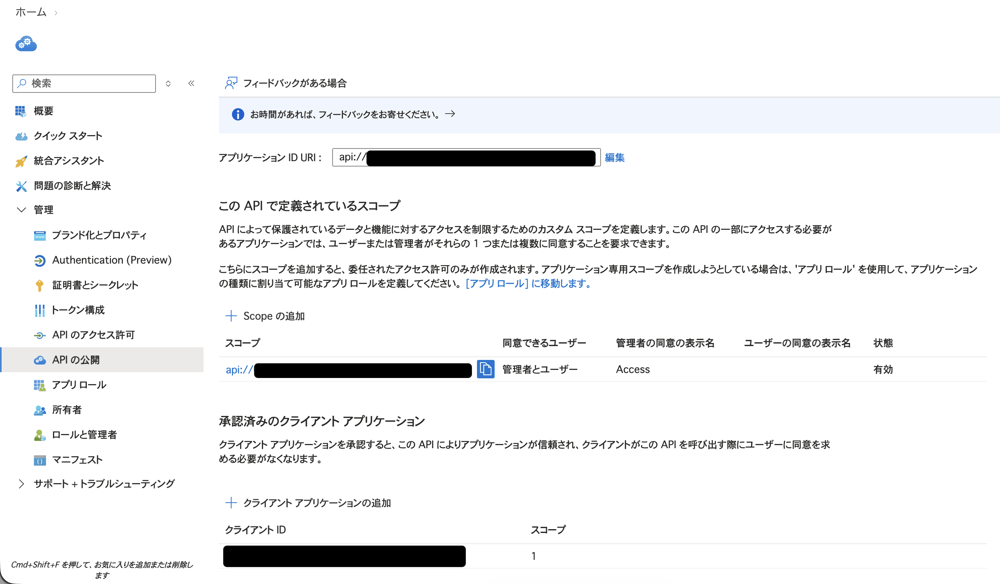
- するとログインできるようになった
  - 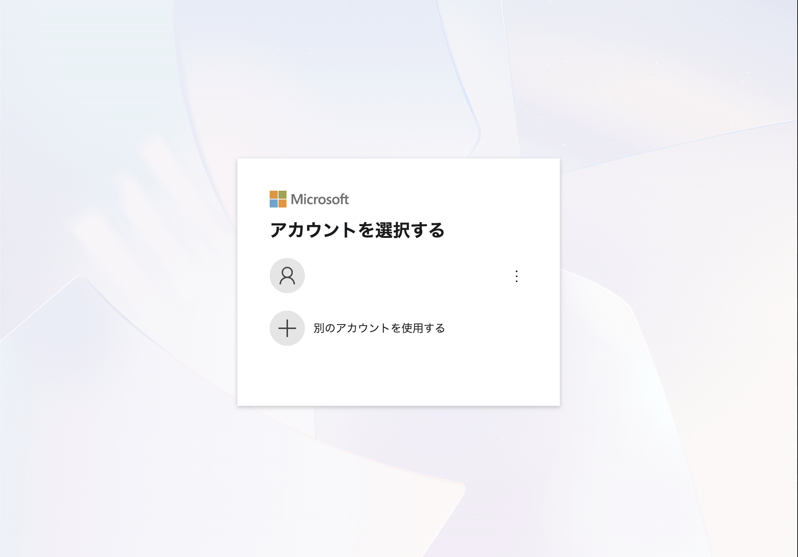
  - 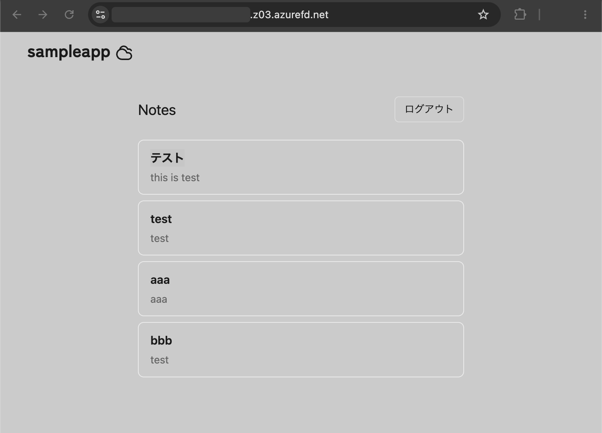
- まじで使う時はちゃんと確認した方がいい
