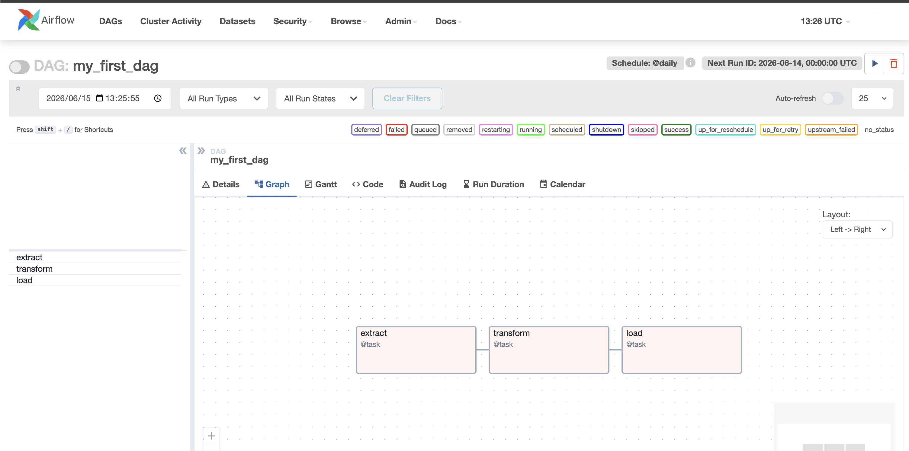

# apache airflow

- ワークフロー
  - ETL寄りのワークフローという認識
- クラスターだった
  - ぱっと見 webserver と scheduler (runner) の2つが最低限必要
  - scheduler は複数台置けるんだろうなあ。
  - やっぱワークフロー系って登場人物が多いから、ローカルのセットアップ大変だなあ。
  - 初心者にセルフホストはきつそうな印象
    - 初っ端は AWS MWAA が良さそう
    - きつそうというか何を監視すべきかって肌感を得るのに時間かかりそう。
    - 初っ端は dag のコードに集中すべき
- dag の仕組みはよくできていると思った。
  - コードを読み取って管理画面に各種設定値が反映されていた。
  - あとなんていうかわからんが各タスクの依存関係が図示されているのがすごい
    - Go の DI ライブラリの wire をちょっと思い浮かべた。全然関係ないけど
    

### Links
- https://airflow.apache.org/docs/apache-airflow/stable/start.html
