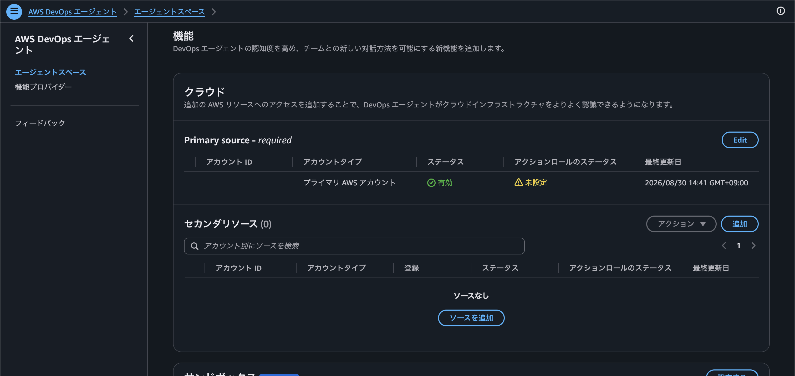
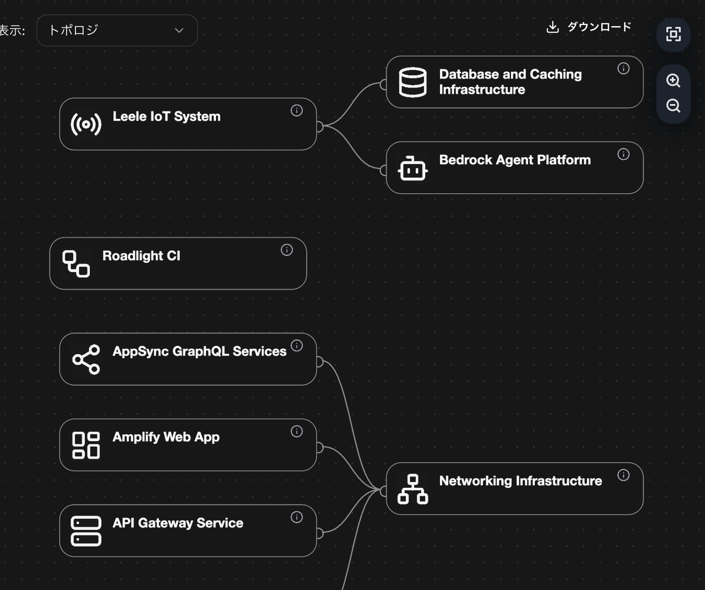

# AWS DevOps Agent

- デザインがまるっきり変わってる
- AWSアカウントを追加可能
  - 自アカウントがプライマリ
  - 他のアカウントも追加できる
    - このアカウントにIAM Roleを追加してみに行く感じ
  - これはワークスペース単位
  - 
  - https://dev.classmethod.jp/articles/aws-devops-agent-add-accounts-secondary-resource/
  - なんかよくわからないけど Azure のアカウントも追加できるっぽい
- どうでもいいけど Princial の Service 名は "aidevops.amazonaws.com" らしい
- Sandbox機能
  - Lambda MicroVMs みたいな。
  - 追加しておく pip package や npm package を指定できる
  - https://dev.classmethod.jp/articles/devops-agent-sandbox-preview/
- トポロジ
  - 事前にリソースを洗い出して関係性を図にまとめておいてくれてる
  - 
- AWSネイティブなChatGPTという表現が正しいかも
  - もっとClaude Codeだとかコーディングエージェント寄りをイメージしていたがそれは難しいかも
