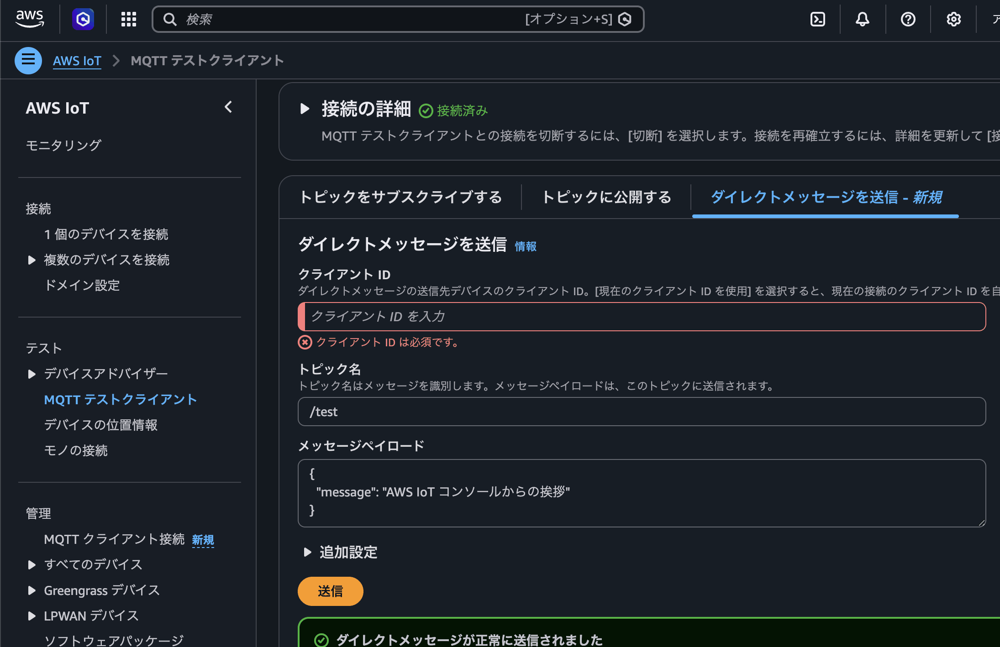

# IoT Core SendDirectMessage

- 特定のモノに対してメッセージを送れる
- 要はデバイス指定できるってこと。
- はじめ意味わからなかったけど AWS コンソールを見たら理解できた
  
- これトピック設計のプラクティスが変わるんじゃないかな
  - 対デバイスへの通信は、これがベストプラクティスになりそう
  - 設計のとき考えることが一つ減るのでは？
    - まあ結局のところ代替策は確保したいから完全無視はできないけど

## Links
- https://aws.amazon.com/about-aws/whats-new/2026/05/aws-iot-core-direct-messaging/
