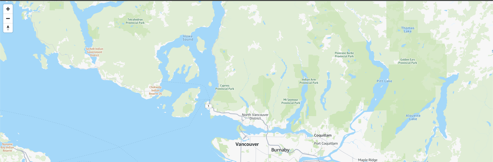

# AWS Location Service

- 地図のサービス
- 配色的に某デリバリーサービスが使っているやつに見える
- サンプルコードにあるJSのライブラリはOSSの標準的なやつっぽい（AWSロックインではないということ？）
  - MapLibre GL JS
  - https://qiita.com/asahina820/items/66cd78a4462db86578a4
- 認証
  - APIキーかCognito
  - https://dev.classmethod.jp/articles/embedding-the-amazon-location-service-map-into-the-application/

### try0 ブラウザで地図を表示する
AWSコンソールにサンプルコードが載っていた。API Key を発行してコードに埋め込むと地図が表示されるようになる。API Keyの埋め込みは本来はダメなんだろうなあ。丸見えだからAPIをたくさん呼ばれてしまいそう

### try1 配色を変える
ダークモードにしたり路線図を表示させたり、あとは衛星画像にしたりできるっぽい

