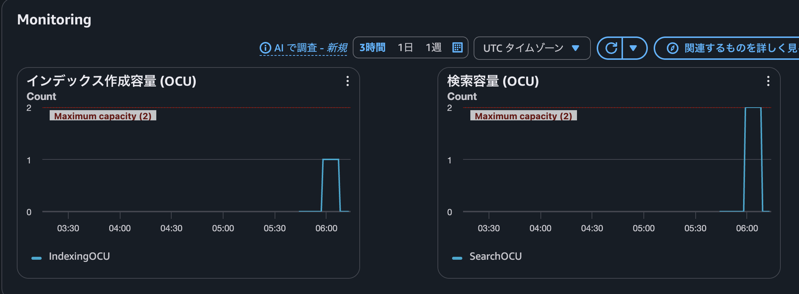

# AWS OpenSearch Serverless NextGen

- いわゆる v2
- scale to zero をサポートした。
  - https://aws.amazon.com/jp/blogs/news/the-next-generation-of-amazon-opensearch-serverless-built-from-the-ground-up-for-agents/
  - アイドルタイムアウト10分を経過したらダウンするらしい
    - この期間を変えられるかは不明。コンソールにはそういう記述なかった
  - 
- 個人的にはコスト面の導入障壁が解消された印象
  - v1 (classic) では最低OCUが高くてサーバレスの割に導入障壁が高かったが
  - ちなみに元々4だったがいつの間にか2まで下がってた。
  https://iret.media/103597
  - 今回のアップデートで0まで下がったという認識
- collection group というものができていた
  - これは2026年2月
  - https://aws.amazon.com/jp/blogs/news/amazon-opensearch-serverless-introduces-collection-groups-to-optimize-cost-for-multi-tenant-workloads/
  - min ocu/max ocu を設定できる
  - collection group のなかで NextGen と Classic は混ぜられなさそう
  - 今のところ collection group は ocu を設定するためのものに見える
  - まあポリシーとかで group 単位で指定できたりするんだろうけど
  - あとメトリクスもここでみれそう
- Serverless ではデータアクセスポリシーやネットワークポリシーを設定する必要があるので、実際に使うときはちゃんと確認した方が良さそう
- Bedrock Knowledge Base のバックエンドとして OpenSearch Serverless が使われることがあるらしく、で、その時にOpenSearchに慣れていないユーザーは、そのコスト増にびっくりしがちだから、その流れでもっとコスト面の障壁を抑えたいっていう意図もありそう
