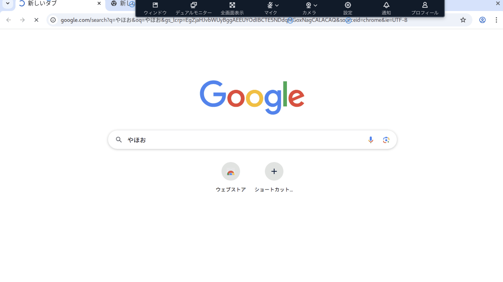
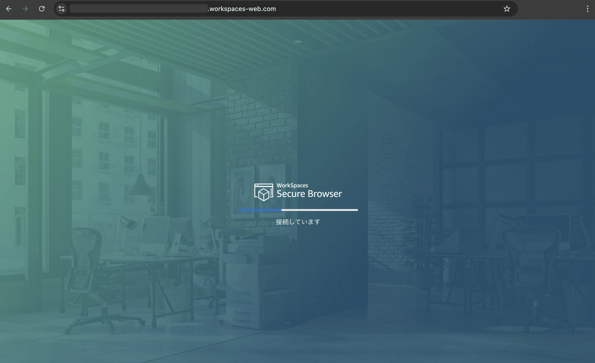

# AWS WorkSpaces Secure Browser

- AWS WorkSpaces family の1サービス
  - コンソールは独立している
  - https://aws.amazon.com/jp/workspaces-family/secure-browser/
- 旧名AWS WorkSpaces Web
- Web Browser に特化した Remote Desktop
  - VPC のなかに chrome があって、それをブラウザ越しに参照する感じ
  - ラグがある感じがまさに Remote Desktop
  - 手元の mac の chrome のなかに、WorkSpaces Secure Browser の chrome がある
  - 
  - 
- VPC (およびそれにつながっているオンプレ)にあるアプリへセキュアにログインできる
  - ちなみに作成するときに VPC ID と Security Group ID を求められた
  - ので、WebブラウザをVPCに置くっぽい
- 内部的には AppStream 2.0 らしい？真偽不明だが、それを簡単にセットアップできるようにした感じらしい
- ポータルを作ると、URLが発行される
  - AWS SSO や外部のidpとSAML認証にてログインできる
  - ちなみにログインは必須
  - public とかはできないっぽい。というよりIdpで制御してねって話だと思う
- 料金体系は正確に理解できてないが、「アクティブユーザー数 * インスタンスタイプ」っぽい
  - 作成するときにインスタンスタイプを指定する必要あり
  - https://aws.amazon.com/jp/workspaces-family/secure-browser/pricing/

## Links
- https://aws.amazon.com/jp/workspaces-family/secure-browser/
- https://zenn.dev/devcamp/articles/3cc896a8e99f04
