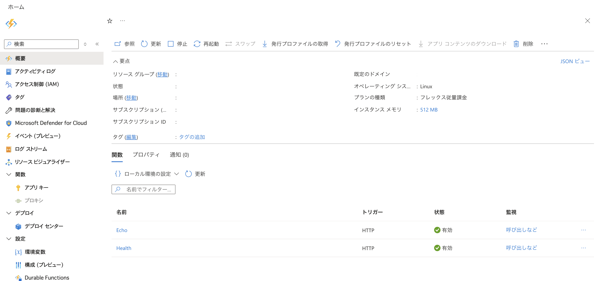
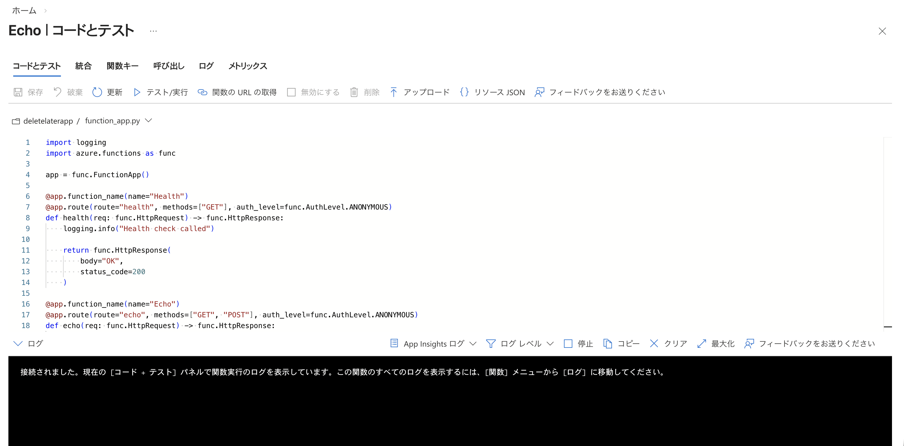
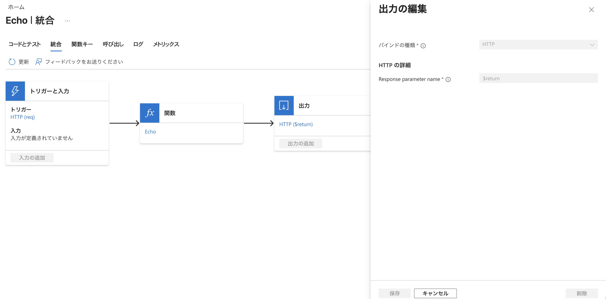
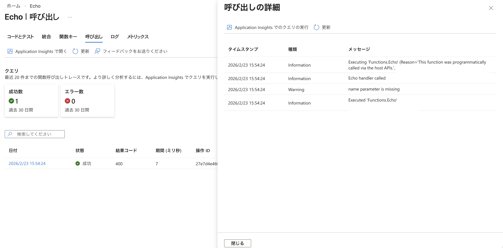
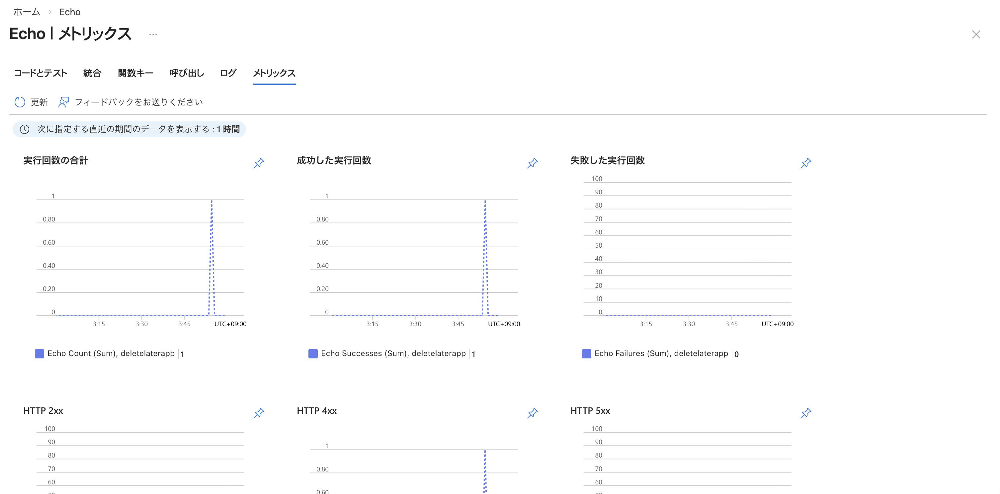

# azure functions python v2

- azure functions
- runtime は python 3.13
  - static web apps は最新が 3.11 だったけどこっちは 3.13 ぽい
- python のプログラミングモデルは v2
  - https://learn.microsoft.com/ja-jp/azure/azure-functions/functions-reference-python?pivots=python-mode-decorators
  - https://zenn.dev/pinter/articles/20230903functionspythondifference
  - エントリポイントのファイルが __init__.py から function_app.py へ変わったっぽい

## requirements
```bash
brew install azure-cli
brew install azure/functions/azure-functions-core-tools@4
```

login 
```bash
➜ az login
A web browser has been opened at https://login.microsoftonline.com/organizations/oauth2/v2.0/authorize. Please continue the login in the web browser. If no web browser is available or if the web browser fails to open, use device code flow with `az login --use-device-code`.

Retrieving tenants and subscriptions for the selection...

[Tenant and subscription selection]

No     Subscription name     Subscription ID                       Tenant
-----  --------------------  ------------------------------------  -----------------
[1] *  aaa  aaa  Default Directory

Select a subscription and tenant (Type a number or Enter for no changes): 1

Tenant: Default Directory
Subscription: aaa
```

- https://learn.microsoft.com/ja-jp/azure/azure-functions/how-to-create-function-azure-cli?pivots=programming-language-python&tabs=go%2Cmacos%2Cbash%2Cazure-cli#install-the-azure-functions-core-tools

## deploy
- `func azure functionapp publish <name> --python` でデプロイできる
- デフォルトだと requirements.txt を見に行く
  - pyptoject.toml で依存管理すると、requirements.txt と重複して困るので、自前で .python_packages にパッケージを置いて `--no-build` フラグをつけてデプロイするのが良い
  - https://learn.microsoft.com/ja-jp/azure/azure-functions/python-build-options#local-build
    - ローカルビルドと呼ぶ方式

```bash
➜ rm -rf .python_packages
➜ uv pip install -r pyproject.toml --python-platform x86_64-unknown-linux-gnu --no-installer-metadata --no-compile-bytecode --target .python_packages/lib/site-packages
Using CPython 3.13.3 interpreter at: .venv/bin/python3
Resolved 3 packages in 76ms
Installed 3 packages in 4ms
 + azure-functions==1.24.0
 + markupsafe==3.0.3
 + werkzeug==3.1.6
➜ func azure functionapp publish deletelaterapp --python --no-build
Getting site publishing info...
[2026-02-23T06:48:58.330Z] Starting the function app deployment...
[2026-02-23T06:48:58.334Z] Creating archive for current directory...
Skipping build event for functions project (--no-build).
Uploading 735.28 KB [#############################################################################]

[2026-02-23T06:51:08.648Z] The deployment was successful!
Functions in deletelaterapp:
    Echo - [httpTrigger]
        Invoke url: https://xxx.azurewebsites.net/api/echo

    Health - [httpTrigger]
        Invoke url: https:/xxx.azurewebsites.net/api/health
```

- 他に、発行プロファイルを用いてデプロイする方式もある
  - FTPでアップロードするらしい？
  - GitHub Actions でこのファイルを見に行ってデプロイすることもできる
    - https://iret.media/118950

## キャプチャ
- 
- 
- 
- 
- 
