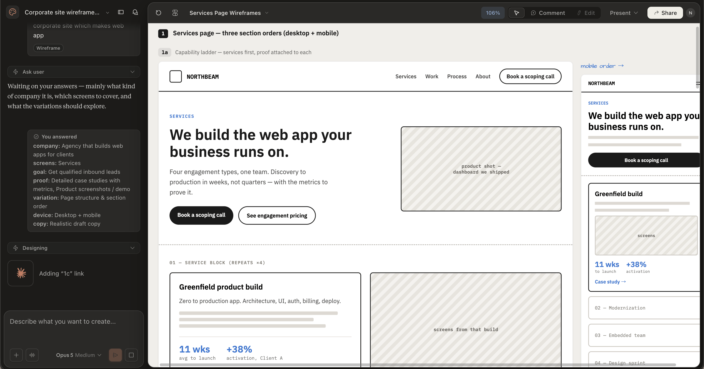

# claude design

- claude.ai から使える
- よくらからないけど pro plan に入っている模様
- まあいわゆる v0 とかと一緒
- はじめにユースケースや何を作るかを聞かれる。
  - ワイヤーフレームであるか
  - モバイルアプリであるか
  - スライドであるかなど
- ただ抽象的なモックアップを作れる点が他と比べて良いと思った
  - 他のやつは具体的すぎて逆にイメージがふくまらない感があるが、これであれば抽象的でざっくりとしているので、もっとこうなんじゃないかって思ったりできるんだなーと。
  - 
- 動画も作れる
  - 音声はつけられないそう
- なんかトークンの消費量が多い気がする
  - pro planではギリギリ。サクッと作るのはできてもそっから指示してたらあっという間に制限くらう
