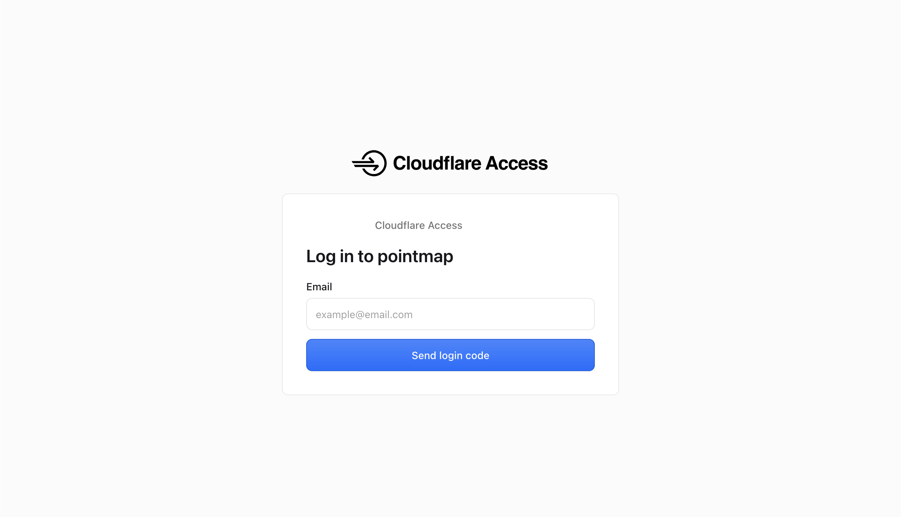

# cloudflare access

- ウェブサイトの前段に認証機構を置いてくれるやつ
- 事例はそれなりにある認識
- 実際使ってみると難しかった
  - 何が難しいかというと設定画面
  - どこを見ればいいか分からん。
  - 文字も多いし
  - 設定内容が多いのはまあ仕方ないと思う
- 基本的には cloudflare zero trust のコンソールで、
  - ポリシーを作成
  - アプリケーションを作成、ポリシーを貼る  
  でよい。ポリシーが多くなったらルールグループを作った方が便利だろうけど、最初はルールグループいらないと思う
- cloudflare でホストしているアプリだけでなくて外部のパブリック/プライベートアプリケーションの前段にもおけるっぽい
  - っぽいけど試してないのでどんなことが必要なのか不明
  - パブリックの前段においても直でアクセスされたらダメなわけだし
- 実際にかけるとこんな感じのログインページ  
  

## Links
- https://blogs.networld.co.jp/entry/2026/03/31/100251
- https://zenn.dev/smartshopping/articles/fd2825c0c61149
