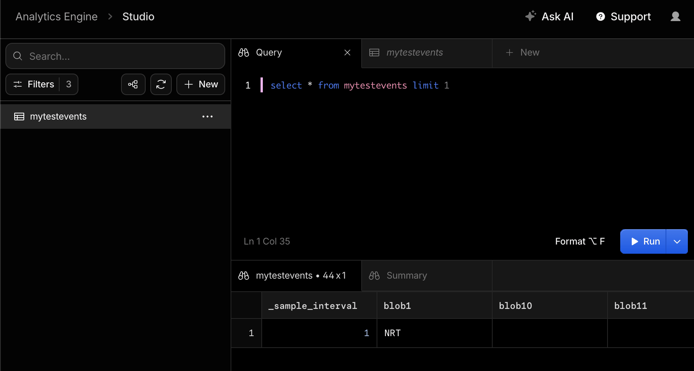
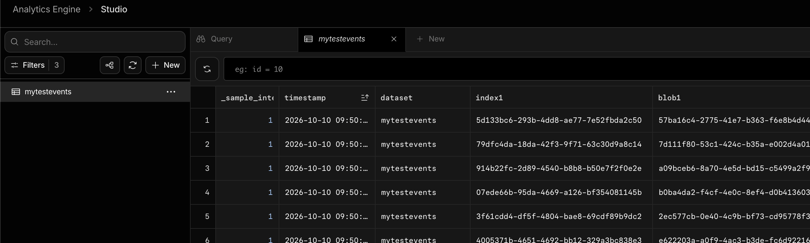

# Cloudflare Analytics Engine

- Worker から Analytics Engine というところにデータを書き込める
- 書き込んだデータは SQL で探索できる
- データの保持期間は通常3ヶ月間らしい
  - https://developers.cloudflare.com/analytics/analytics-engine/limits/
  - ちなみにコンソールからデータ消せそうにない。消せないのかな
- ぱっとみた印象としては S3 + Athena かなー。
  - データの保持期間の件だとか踏まえると実際に選定できるケースは限られそう。
  - あと他の方法は無限にあるので分が悪い印象
- スクショ
  - 
  - 

## Links
- https://developers.cloudflare.com/analytics/analytics-engine/
