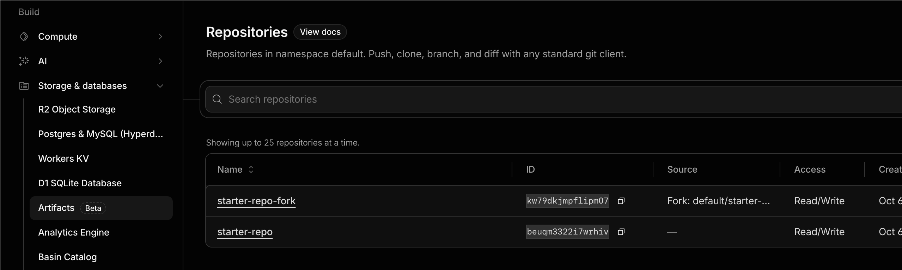

# Cloudflare Artifacts

- わかるようなわからないような
- クラウド上（Cloudflare）に git repo を作れる
  - cloudflare のドキュメントには git 互換のストレージって記載されている
  - https://developers.cloudflare.com/artifacts/
  - まあ要はgitという理解。
  - git repo のことを Artifact と読んでいるっぽい
- カレントディレクトリにある worker (src/index.ts) は、git repo を作るコード
  - これを cloudflare にデプロイすれば、この worker 経由で git repo を作れる
  - 構造的には Cloudflare Container に似ている
- Workers Paid (月5ドル) へ加入する必要あり
- コンソールにも Artifacts はあった。
  - 一応ストレージという枠に収まっている
  

## Links
- https://developers.cloudflare.com/artifacts/
