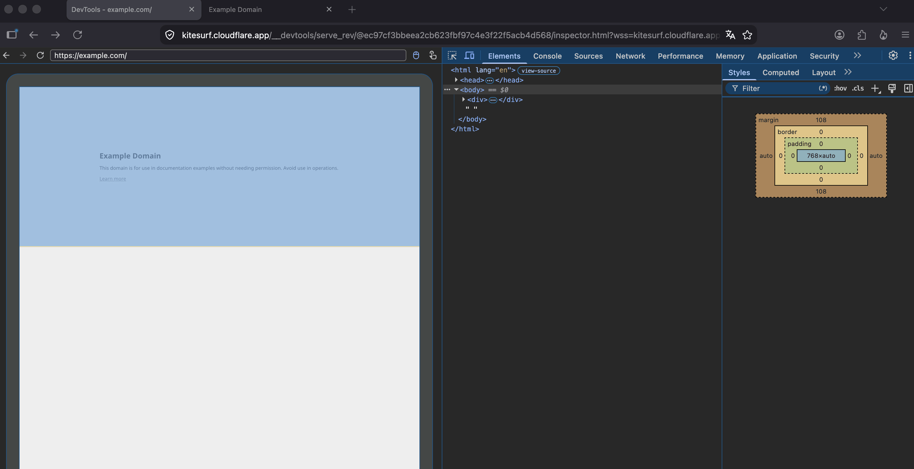

# Kitesurf

- Cloudflare
- 軽量なブラウザ
- rustで書かれていてwasmで動くっぽい？
- 公式サイトに playground がある
  - 画面右の devtool は kitesurf のものっぽい？少なくとも firefox の devtool ではなさそうに見えている
  
- これ多分 Browser Run のブラウザになるんだろうなあ。
  - https://developers.cloudflare.com/browser-run/kitesurf/
- GitHub にソースコードはないっぽい

## Links
- https://kitesurf.cloudflare.app/
- https://blog.cloudflare.com/kitesurf/
