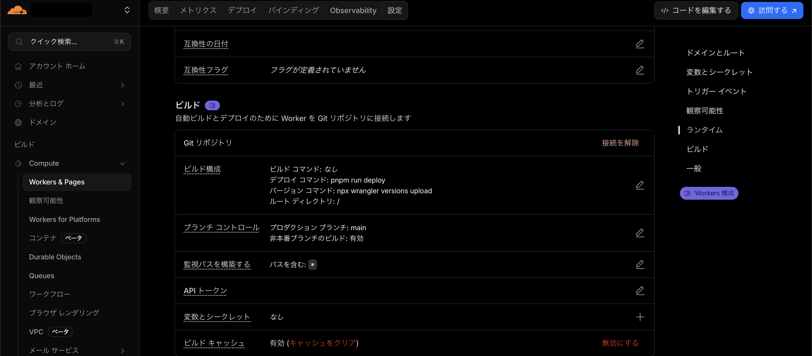
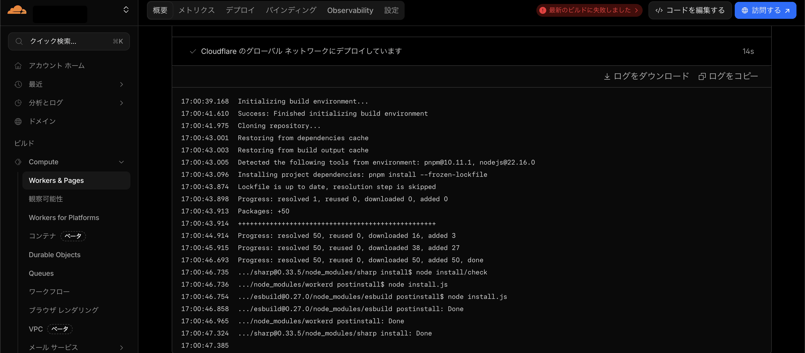
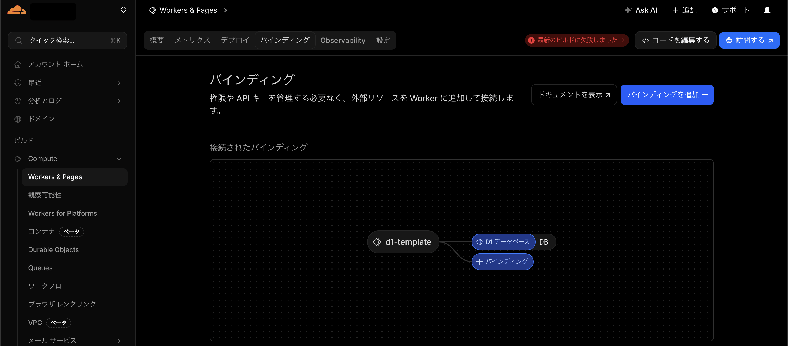

# CloudFlare Worker + D1 Database

- UIがまるっきり変わってた
- ビルドコマンドはUIから設定するらしい
  - wrangler.json でも設定できるのかな、不明
  - pnpm-lock.yaml があるからか pnpm で依存パッケージをインストールしていた
  - 
  - 
- 相変わらずバインディングは設計思想と優れていると思う
  -   

## Commands
```
npm create cloudflare@latest -- --template=cloudflare/templates/d1-template
npm install
npx wrangler d1 create d1-template-database
npx wrangler d1 migrations apply --remote d1-template-database
npx wrangler deploy
```
