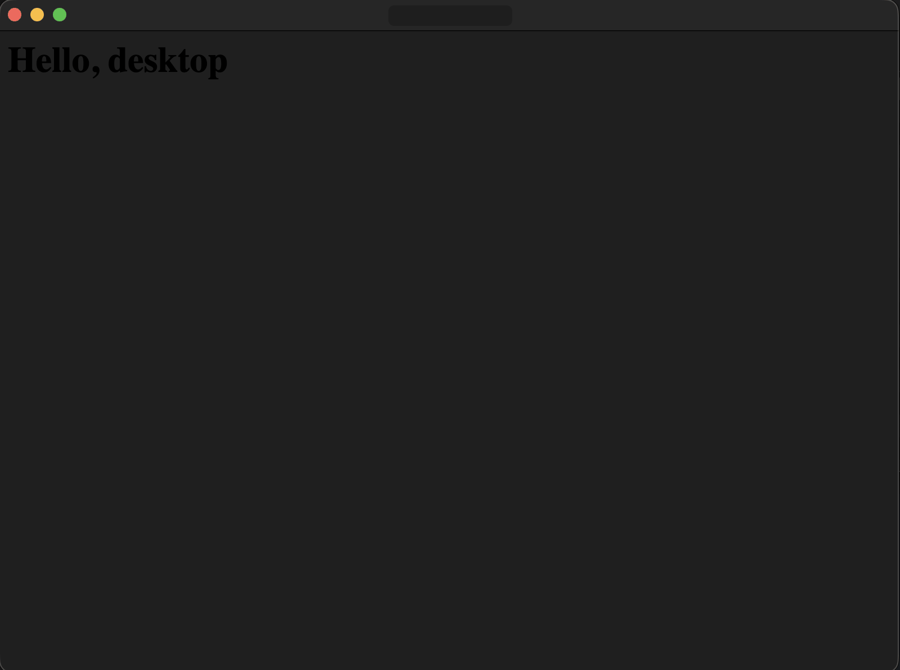

# deno-desktop-try

- デスクトップアプリを作れる  
  
- ファーストインプレッションでは簡単だった。
- webview ベース。なんか cef っていうのにも変えられるようだけどこれは `bundled Chromium` らしい
- コードを見るに、基本、HTMLで書いてレスポンスする思想なのかな
  - `Deno.serve` ってあるからサーバーが立ち上がるんだろうなあ。
- deno v2.9.0 でリリースされる模様
  - まだcanaryにしかない
  - brew 経由で deno をインストールすると `deno upgrade` コマンドが使えなかったので、一度 github より最新の deno のバイナリをダウンロードしてそれで `./deno upgrade --canary --output ./denoc` ってコマンドを叩いて canary をダウンロードした

## Links
- https://docs.deno.com/runtime/desktop/
- https://docs.deno.com/runtime/reference/cli/desktop/
