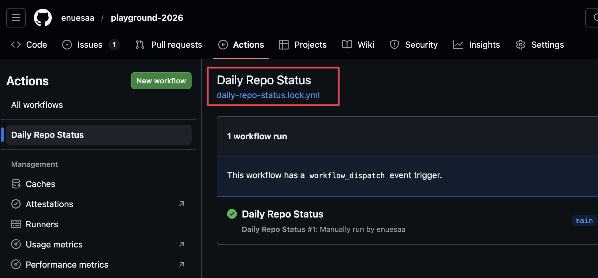
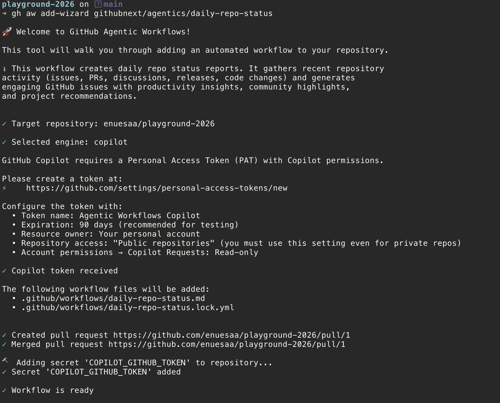
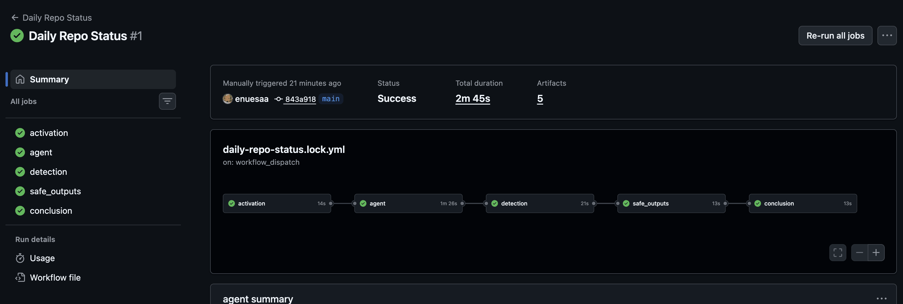
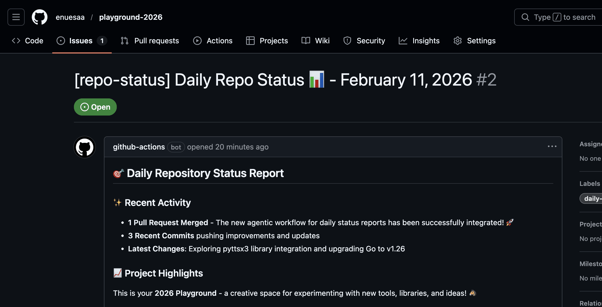

# GitHub Agentic Workflow

- GitHub Actions でLLMを呼べる
  - Issueを作ってもらったり。更新してもらったり。
  - LLMを呼べるのがいちばんの特徴。
- GitHub Actions に乗っかっている
  - actions の workflow の構文を拡張する
  - 書いたら actions の yml に変換するイメージ
  - CloudFormation における SAM みたいなそんな感じ
- 概念
  - Agentic Workflows CLI `gh aw`
  - Agentic Workflows のテンプレ
    https://github.com/githubnext/agentics/blob/main/workflows/daily-repo-status.md
  - `gh aw add` or `gh aw add-wizard` で、テンプレをカレントリポジトリに追加できる
- Agentic Workflows CLI は、作成するときだけ必要そう
- Github Actions との統合は次のような感じ
  - `.github/workflows/daily-repo-status.md`
    - これが、GitHub Agentic Workflow の大元。
    - で、このファイルを Agentic Workflows CLI が読み取って、yml ファイルに出力する（コンパイルと呼ぶ）
    - .md なので GitHub Actions はこのファイルを認識しない。呼べない。
  - `.github/workflows/daily-repo-status.lock.yml`
    - これが、出力物
    - .yml なので、GitHub Actions はこのファイルを認識する。
    
- 仕組みとしては面白い
  - .yml にコンパイルする発想、、よくできているなあと思った
- ただ、ふつうに actions の yml を書いてもいいのでは？直接。
  - 個人レベルだとしんどさを感じてないから直接書いたほうが、楽なような気がする

## チュートリアル
- https://github.github.io/gh-aw/setup/quick-start/
- このチュートリアルは Agentic Workflow のサンプルをダウンロードして、それをリポジトリに追加 & 実行してるっぽい
```bash
gh extension install github/gh-aw
# カレントリポジトリに githubnext/agentics の daily-repo-status.yml を追加しているっぽい
# see https://github.com/githubnext/agentics/blob/main/workflows/daily-repo-status.md
gh aw add-wizard githubnext/agentics/daily-repo-status
```
- 
- 
- 

## Links
- https://github.com/github/gh-aw
- https://azukiazusa.dev/blog/natural-language-ci-cd-with-agentic-workflows/
