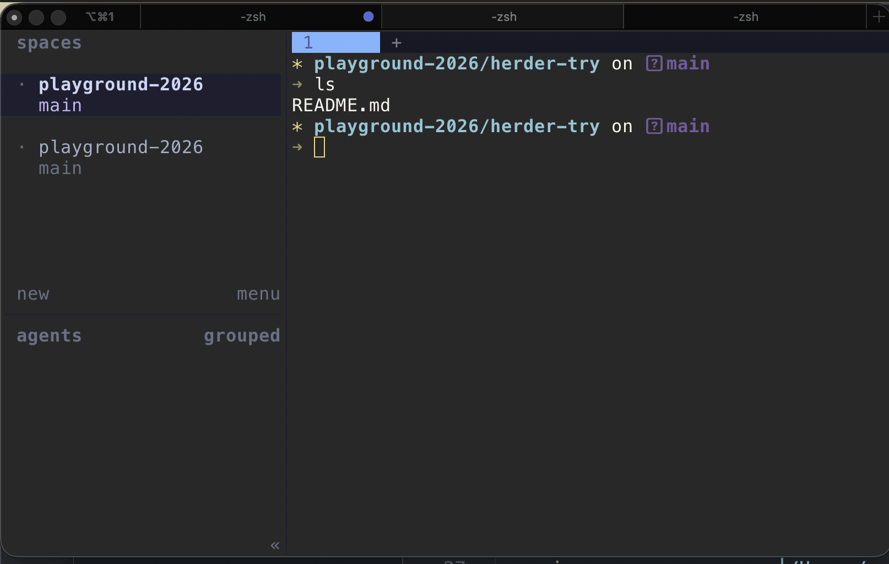

# herdr

- いわゆる terminal の multiplexer
  - tmux みたいなもん
  - ワークスペースを増やしたり、右にタブを増やせる
- AI ネイティブ
- コマンド
  ```bash
  ctrl+b then shift+n for a new workspace
  ctrl+b then v or minus to split panes
  ctrl+b then c for a new tab
  ```
- いつも思うけど覚えたら早いんだろうなあ。
- UNIX ドメインソケットでなんか指示を送れるそう。
  - なので AI と統合しやすいんだろうなあ。
  - https://zenn.dev/studypocket/articles/herdr-ai-agent-multiplexer#cli-%E3%81%A8-unix-%E3%82%BD%E3%82%B1%E3%83%83%E3%83%88-api
  - ものとしては興味深い
  - vercel の agent-browser もこういうふうにステートフルで CLI から命令出す感じだったなあ。こういうのが設計として良いのかも。

## Commands
Install
```bash
brew install herdr
```

up
```bash
herdr
```


## Links
- https://github.com/ogulcancelik/herdr
