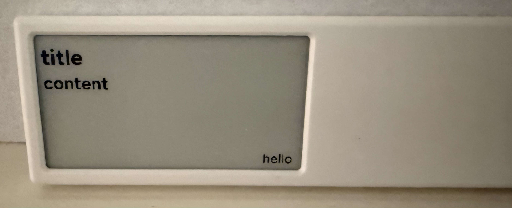

# quote0

- https://dot.mindreset.tech/product/quote
- 電子ペーパー
- API で表示内容を変えられる
- 最近発売された？デバイスなので、バグが多いが、コンセプトはいい
- 全体的によくできている

### テキストAPI
https://dot.mindreset.tech/docs/service/open/text_api

```bash
➜ curl --request POST \
  --url https://dot.mindreset.tech/api/authV2/open/device/{ID}/text \
  --header 'Authorization: Bearer {TOKEN}' \
  --header 'Content-Type: application/json' \
  --data '{"refreshNow":true,"title":"title","message":"content","signature":"hello","link":"https://example.com/"}'
{"code":"xx","message":"デバイス xx のテキスト API コンテンツが切り替わりました。"}
```


