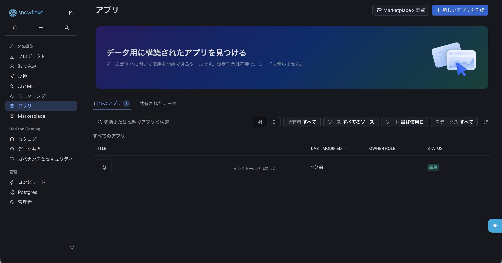
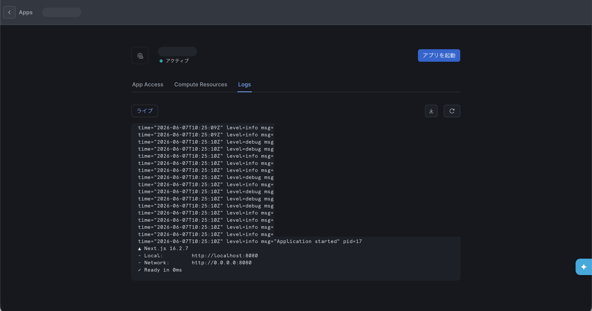
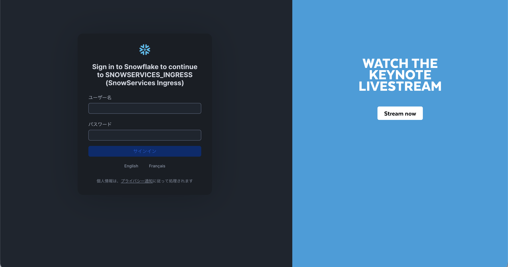
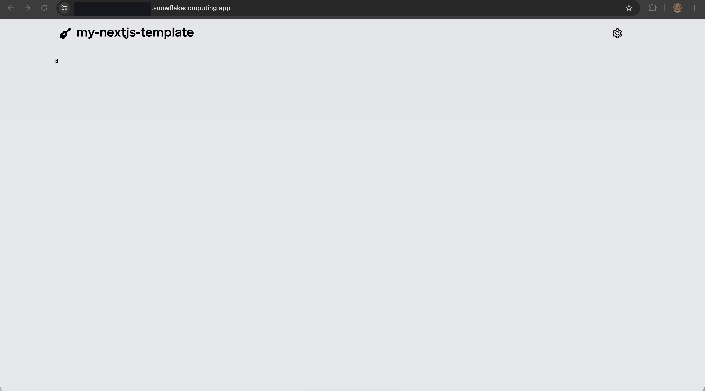

# snowflake app runtime

- snowflake でウェブアプリが動く
- ランタイムサポートは next.js / python がめいんらしい
  - `During public preview, App Runtime builds Node.js apps (with a focus on Next.js). Python support is planned`
  - https://docs.snowflake.com/en/developer-guide/snowflake-app-runtime/about-snowflake-app-runtime
- snowflake summit 2026 で登場（2026年6月）
  - https://zenn.dev/snowflakejp/articles/9e5b8fa393ccd8
- これまでも streamlit のアプリをホスティングしたりはできたけど、next.js 等のホスティングもできるようになった
  - 何でもかんでもデプロイできるわけじゃなくて対応しているアプリケーションが決まっているっぽい
  - ログを見たら next.js というワードが流れており、どこかでフレームワークの判定をしているっぽい
  - で、フレームワークにあったビルド？もしくはホスティングをしている様子
  - next.js の場合いわゆる SSG はできなさそうだった。ビルドに失敗した。
  - ので SSR にしたらビルドに成功した
- くくりとしては「アプリ」
  - コマンドラインでデプロイすると管理画面の「アプリ」に出てくる
  - のちのち管理画面でも作成できるようになるのかな？
- デプロイするとurlが払い出される
  - url をクリックすると snowflake へログインが促されるので、それでログインすると画面を見れるようになる
- 裏側の仕組みはよくわからないなあ。
  - 一応ウェアハウスが起動してないとデプロイに失敗するみたいな挙動だったが、そもそも snowflake に関する知見がなさすぎてよくわからん
  - CoCo についても何者かよくわかってない。
- snowflake へのログインが求められる以上、ターゲットは snowflake の既存ユーザーであり、例えばウェブエンジニアを取り込もう、vercel を目指そうみたいな意図はないんだと思う。シンプルにデータ可視化の観点でウェブアプリをデプロイできれば便利だよね、って感じと想像
- そもそもろんで snowflake でコンテナを起動できたらしい
  - snowpark container service
  - ただし gui がなくてこれは。sqlでリポジトリを作ったりエンドポイントを導いたりする必要があるっぽい
  - https://tech.layerx.co.jp/entry/2025/12/22/204104

### Commands
```bash
➜ snow app deploy --verbose
Bundling source files for ''
Creating workspace ...
Uploading bundled files to snow://...
2026-06-07 18:54:06 INFO time="2026-06-07T09:54:00Z" level=info msg="[CONFIG] Using generated build command" command="npm run build"

App ready at https://xxx.snowflakecomputing.app


➜ snow app teardown
Successfully dropped application service ...
```

### デプロイすると
- 
- 
- 
- 
