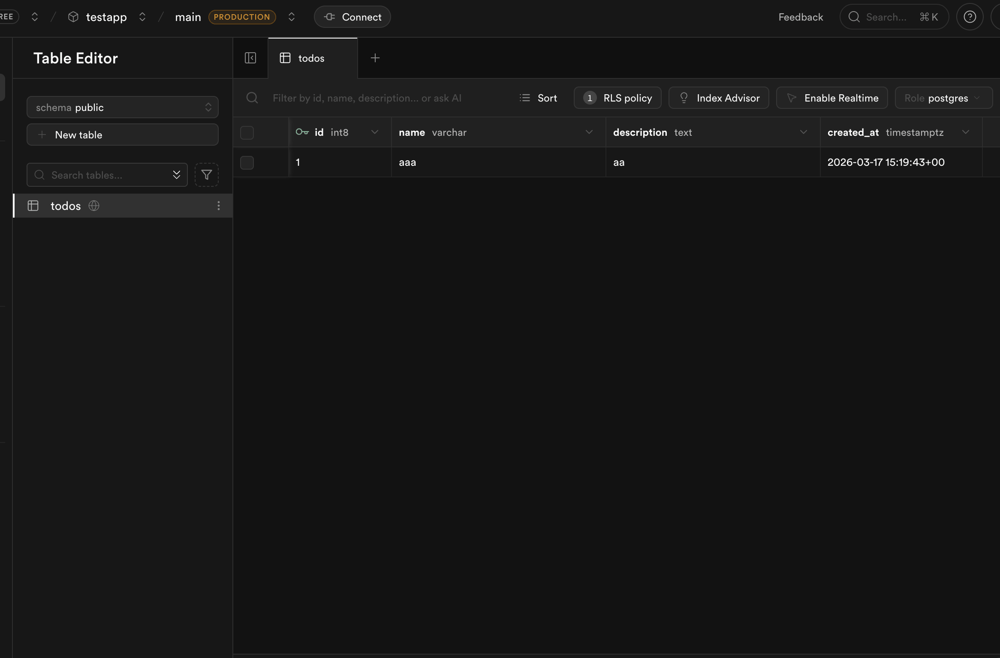
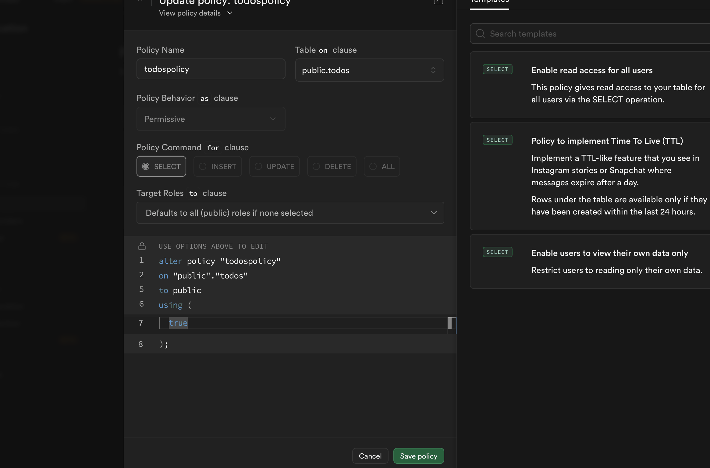
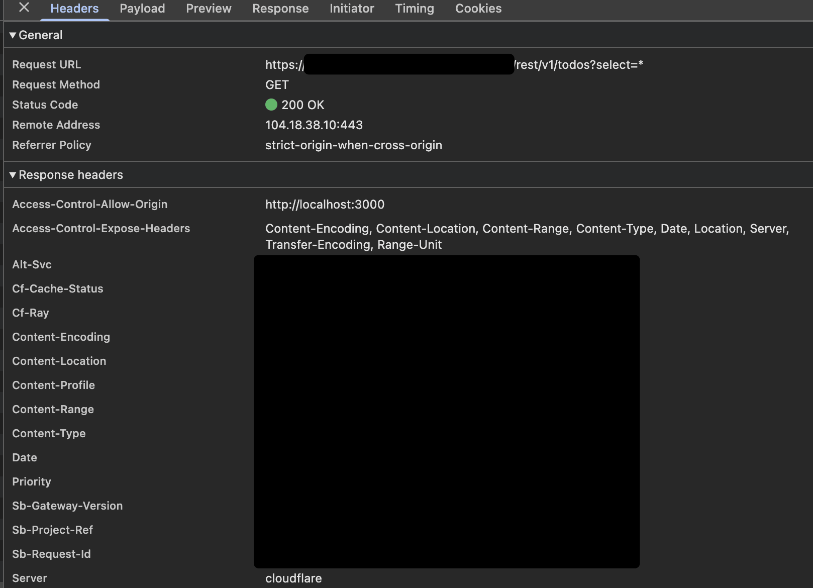

# supabase

- 久しぶりに触った。
- イメージしてたものとは変わってない。
- 相変わらず db admin ui は便利。わかりやすい。
  - 
- フロントエンドアプリからもデータを読める
  - データを読むには Policy を事前に設定する必要がある
    - https://supabase.com/docs/guides/database/postgres/row-level-security#policies
    - 以前試した時にこれを作った記憶がないので、内部で勝手にいい感じに作ってくれていたか、自分がフロントエンドアプリからデータを読んでなかったかのどちらかだと思う。
    - 
  - 結局どんな感じに通信するんだっけと見てみたら。
    - 
    - postgrest が前段に立っている認識
    - https://github.com/PostgREST/postgrest
- 以前はバックエンドレイヤーをローコードにするために、こういうのが流行ってた記憶があるが、AI全盛期のいまでもこの方針でいいのだろうかと思うことはある
  - バックエンドで実装すべき処理は確実にあり、で、AIにより実装工数が減っているので、それを考えるとバックエンドは自前で持って、dbレイヤーだけsupabaseにするのが無難個かな、と今思った。
- edge functions なるものが生えていた
  - 前からあったかな。記憶ない
  - deno で書くらしい
  - https://giginc.co.jp/blog/giglab/supabase-edge-functions
- branching
  - db も複製される？ぽい
  - ブランチごとに接続先があるイメージ
  - https://supabase.com/blog/branching-2-0
  - https://emiliotaylor.medium.com/supabase-database-branching-the-complete-guide-for-modern-developers-5154c6d47ad6
  - pro プラン(25ドル) の契約が必要
  - https://todoonada.co.jp/15410/
