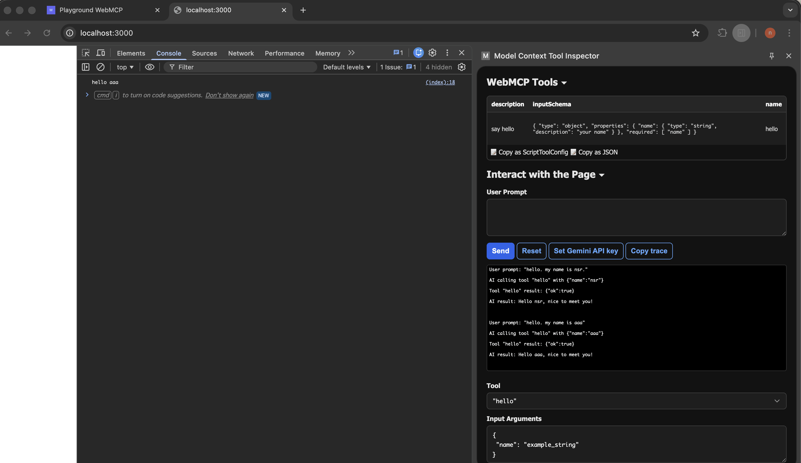

# webmcp

- コンセプト
  - JSでMCP Toolを登録できる
  - Chrome の拡張機能で MCP Tool を呼べる
- コンセプトはわかりやすいし、明らかに便利そう
- 個人的に求めていたもの。セマンティックウェブのその先がこれなんだろうなあ感がある
- Chrome 146以降でできるようになるらしい
  - まだリリースされてないので Chrome Canary で試した
  - その上でフラグの有効化
- 拡張機能は、多分なんでもいいんだろうなと思ってる
  - この拡張機能は、あくまでGUI。インタフェースとして必要
  - ふつうに Claude から呼び出すのであれば、拡張機能は不要
  - 今回は、下記をインストールして、Gemini API Key を登録した
    - https://chromewebstore.google.com/detail/model-context-tool-inspec/gbpdfapgefenggkahomfgkhfehlcenpd?pli=1
  - 
- https://webmcp.sh/
  - このサイトでテストできるらしいが、動作が怪しいのでやめて index.html を自前で用意した

## Links
- https://webmcp.sh/
- https://azukiazusa.dev/blog/webmcp-for-web-applications/
