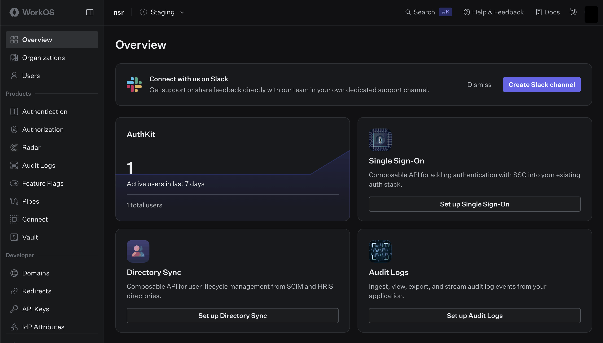
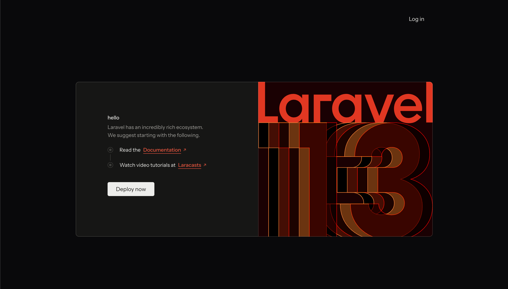
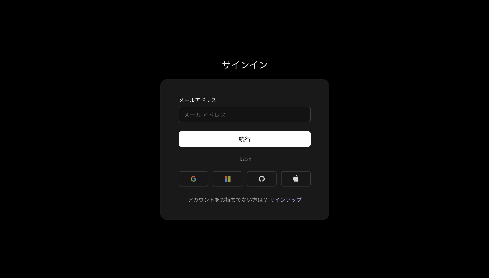
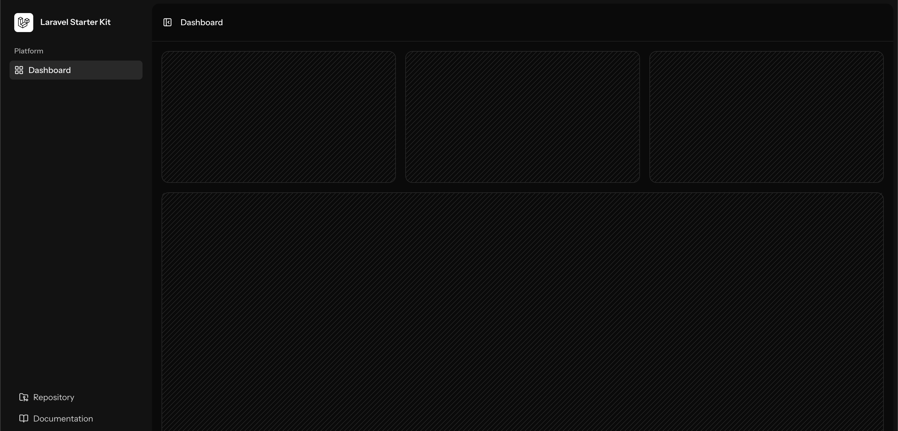

# workos

- IDaaS
- SSO とかできる
- 実務で使えるレベルっぽい
  - ある程度信用できるという意味
  - IDaaS においては有名っぽいが、一般的にはあまり知名度がないのでジャッジが必要そう
- 管理画面  
  

## Laravel Starter Kit

- Laravel の Starter Kit に WorkOS のチュートリアルが混じってる
  - https://laravel.com/docs/12.x/starter-kits#workos
  - https://qiita.com/reirev2913/items/f6c35e92af2301f775dc
- ./laraveldemoapp 配下で実際に試してみた
  ```bash
  0. Laravel アプリのセットアップ
  1. 環境変数をセット
  2. WorkOS にコールバックURLを登録
  ```
  - これだけでまるまる動いた。
  - 立ち上げるとこんな感じ。
    - トップページ  
      
    - ログイン画面
      これは WorkOS のドメインなので、実際にはカスタマイズが必要そう  
      
    - ログイン後
      どうでもいいが WorkOS の管理画面のページのデザインに似ている  
      

## Links
- https://workos.com/
 
